<p align="center"></p>

# OnlineCopyPaste

<p align="center">
  <a href="https://github.com/juanmitaboada/copypaste/actions/workflows/ci.yml"></a>
  <a href="CHANGELOG.md"></a>
  <a href="LICENSE"></a>
  <a href="CHANGELOG.md"></a>
  <br>
  <a href="https://www.php.net/"></a>
  <a href="https://nginx.org/"></a>
  <a href="#layout-on-the-server"></a>
  <a href="#layout-on-the-server"></a>
  <a href="#themes"></a>
  <a href="SECURITY.md"></a>
</p>

A minimal, self-hosted online copy/paste notebook: open a short code, paste, and it is
there on every other machine (and for whoever you give the code to). The app calls
itself just `cp`.

One PHP entry point, flat files on a size-capped loop filesystem, nginx in front,
14 selectable themes, no accounts, no database, no JavaScript framework.

- `https://<domain>/` — type a code to open a note (`priv/<code>` opens a private one).
- `https://<domain>/<code>` — public note: anyone with the link reads it (and edits it, in edit mode).
- `https://<domain>/private/<code>` — private note, behind HTTP basic auth.
- `https://<domain>/new` — create notes and list them, behind HTTP basic auth.
- `https://<domain>/new/<code>`, `/new/private/<code>` — settings and owner editing.

After creating or saving from `/new`, editable notes open in their (live-updating)
editor, already unlocked if you gave them a password; read-only and burn-after-reading
notes stay on their settings page.

## Note modes

| Mode | Visitors | Owner (`/new/...`) |
|------|----------|--------------------|
| `edit` | read, edit (autosave), delete | everything |
| `readonly` | read | edit, delete |
| `burn` | one reveal, then deleted | edit, delete |

Optional per-note password (argon2id hash; unlock cookie is HMAC-signed and bound to the
password, so changing it logs everyone out). Expiry: 7 days after last change (public
default), 1 h, 1 day, 7 days or never (private default).

Concurrent edits: every save carries the hash of the version it started from; if the
server copy changed meanwhile, the save is refused (409), autosave stops and the page
offers "Copy my text" + "Reload".

Live updates: open pages (editable and read-only) poll the server every 3 s while the
tab is visible, and check at once when it becomes visible again. Changes from other
machines appear without reloading, keeping the caret next to the text it was at. If
you have unsaved text when a newer copy arrives, you get the conflict banner instead
of losing either version. Polls are cheap (`204` when nothing changed) and are left
out of the nginx access log. Short polling rather than a held-open connection on
purpose: each open connection would pin one of the pool's 5 php-fpm workers.

## Themes

Each instance picks its look in `etc/theme` (default `terminal`); each theme below
shows the entry page (left) and the editor (right). The entry page is
the same in all of them: the octopus, the name, a field and a discreet `+`, so a
visitor who lands on the URL learns nothing about what the site is. The octopus takes
each theme's colours and stops moving for visitors who ask their system for reduced
motion.

<table>
  <tr><td colspan="2"><b>A · Terminal</b> · <code>terminal</code> · dark, monospace, green prompt</td></tr>
  <tr>
    <td>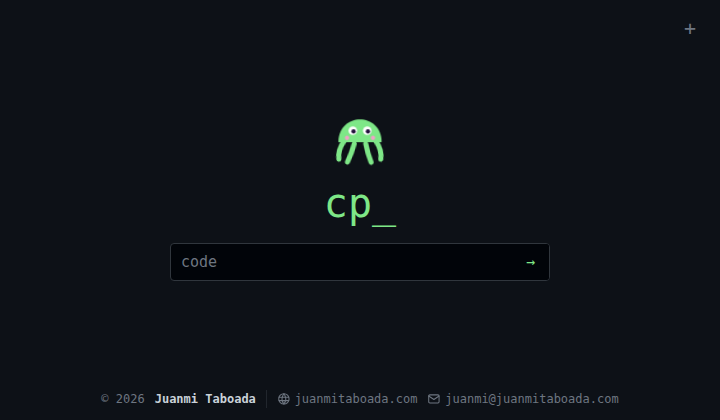</td>
    <td>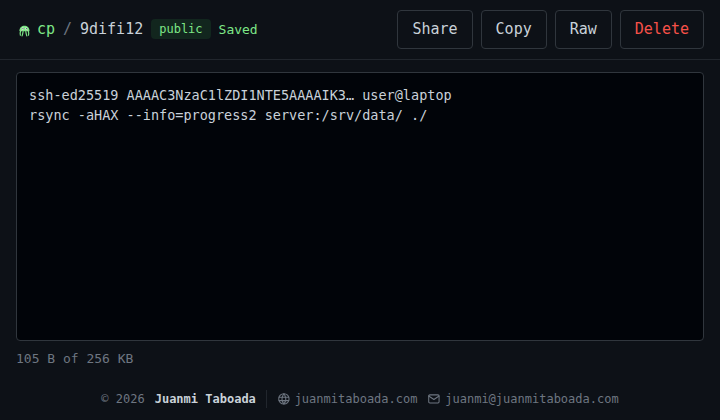</td>
  </tr>
  <tr><td colspan="2"><b>B · Paper</b> · <code>paper</code> · light, serif, almost empty</td></tr>
  <tr>
    <td>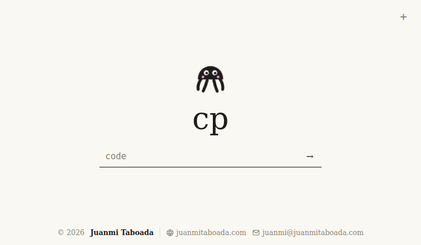</td>
    <td>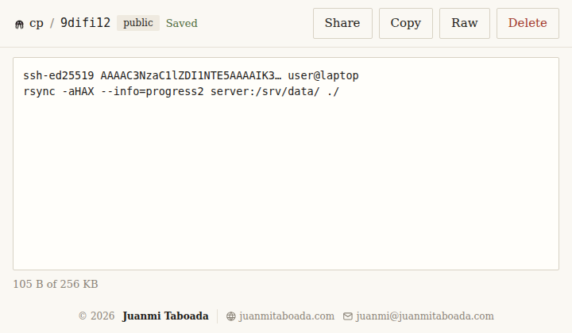</td>
  </tr>
  <tr><td colspan="2"><b>C · Brutalist</b> · <code>brutalist</code> · thick borders, colour block</td></tr>
  <tr>
    <td>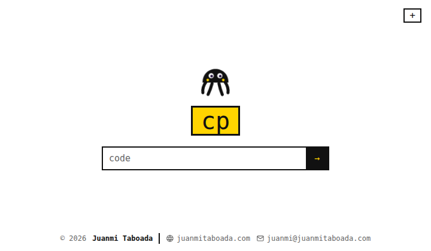</td>
    <td>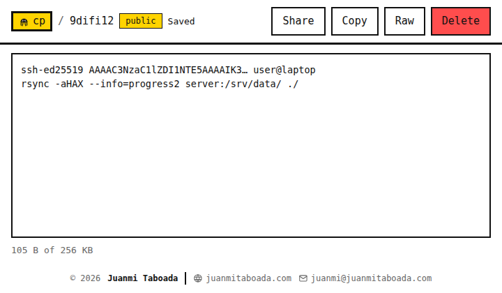</td>
  </tr>
  <tr><td colspan="2"><b>D · Night</b> · <code>night</code> · dark slate, violet accent, rounded</td></tr>
  <tr>
    <td>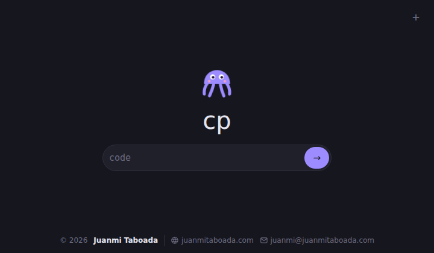</td>
    <td>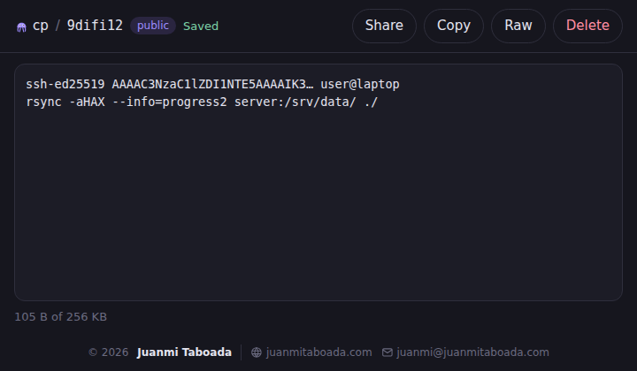</td>
  </tr>
  <tr><td colspan="2"><b>E · Solarized</b> · <code>solarized</code> · cream, teal accents</td></tr>
  <tr>
    <td>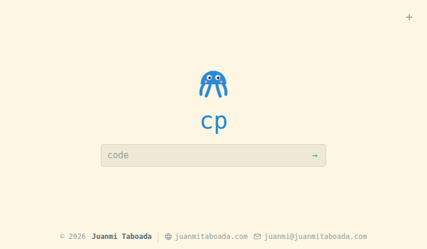</td>
    <td>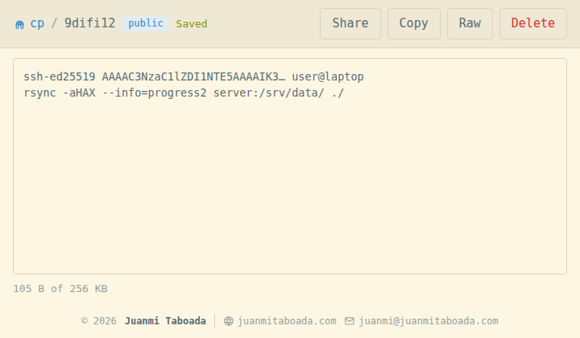</td>
  </tr>
  <tr><td colspan="2"><b>F · Nord</b> · <code>nord</code> · dark polar blue</td></tr>
  <tr>
    <td>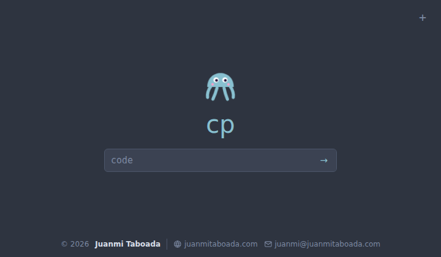</td>
    <td>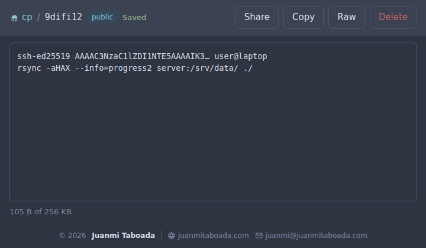</td>
  </tr>
  <tr><td colspan="2"><b>G · Amber CRT</b> · <code>crt</code> · old monitor phosphor</td></tr>
  <tr>
    <td>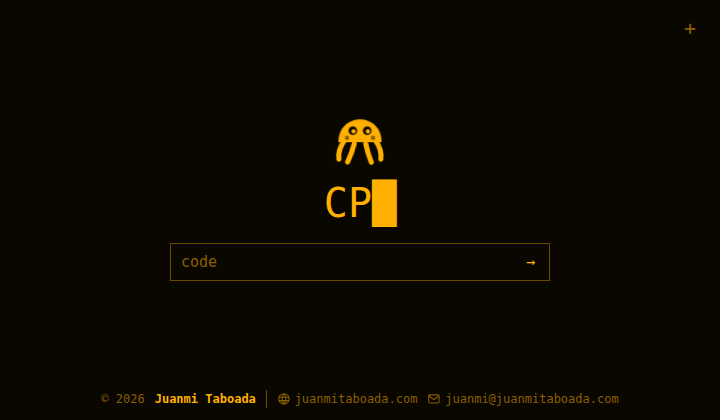</td>
    <td>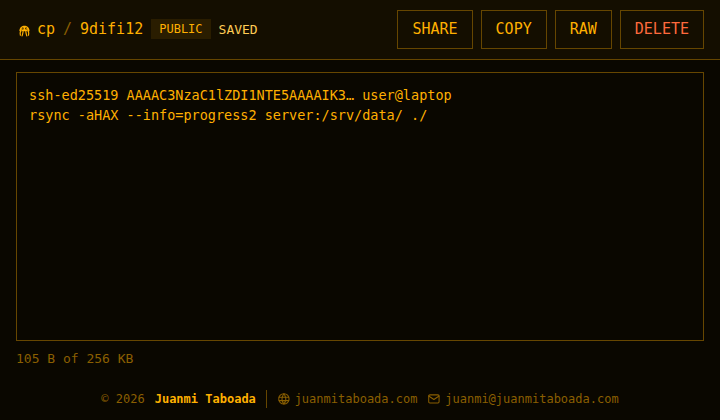</td>
  </tr>
  <tr><td colspan="2"><b>H · Swiss</b> · <code>swiss</code> · white, red, heavy type</td></tr>
  <tr>
    <td>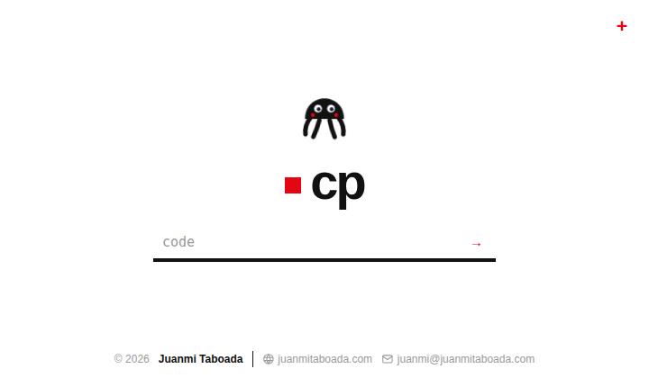</td>
    <td>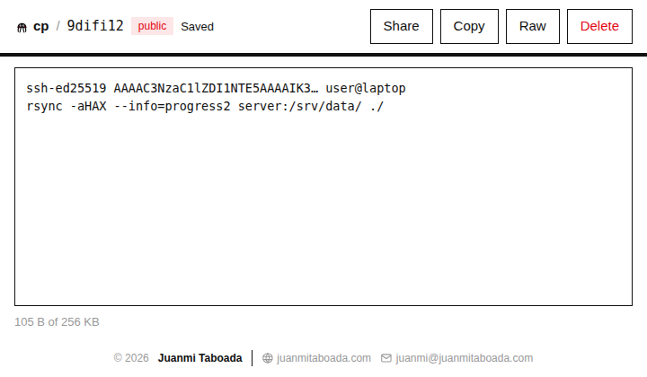</td>
  </tr>
  <tr><td colspan="2"><b>I · Blueprint</b> · <code>blueprint</code> · blueprint blue, white lines</td></tr>
  <tr>
    <td>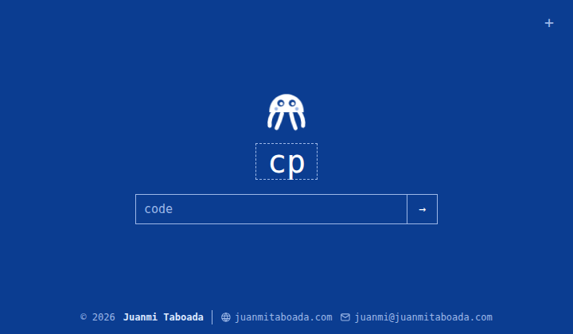</td>
    <td>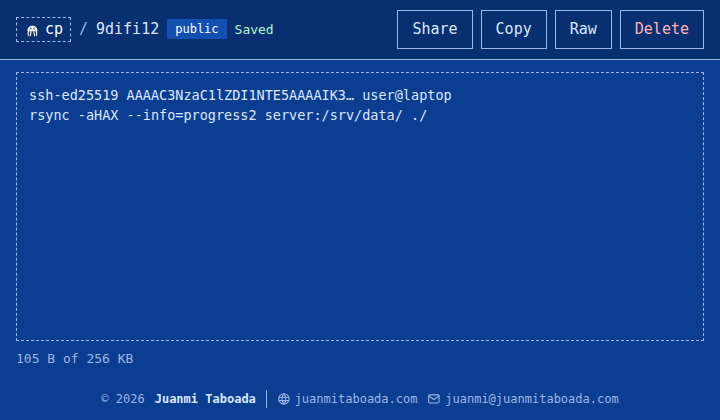</td>
  </tr>
  <tr><td colspan="2"><b>J · Handheld</b> · <code>handheld</code> · four shades of green</td></tr>
  <tr>
    <td>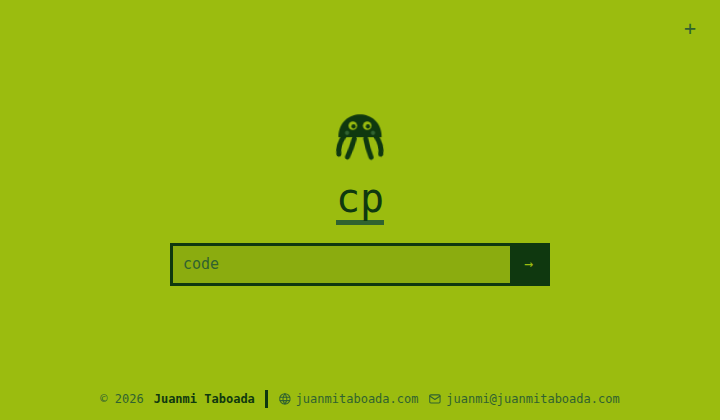</td>
    <td>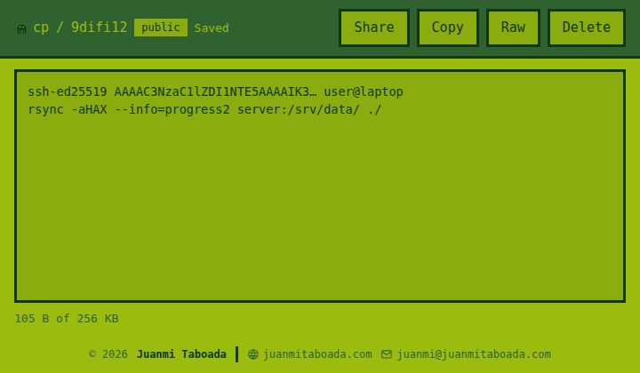</td>
  </tr>
  <tr><td colspan="2"><b>K · Typewriter</b> · <code>typewriter</code> · sepia, faded ink</td></tr>
  <tr>
    <td>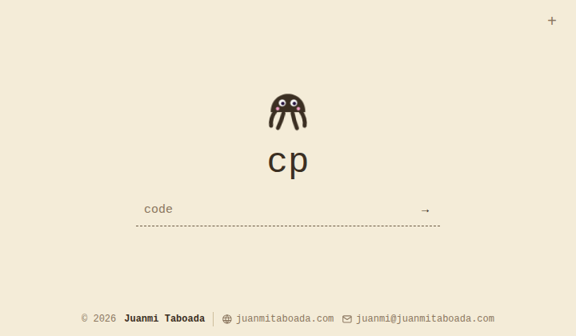</td>
    <td>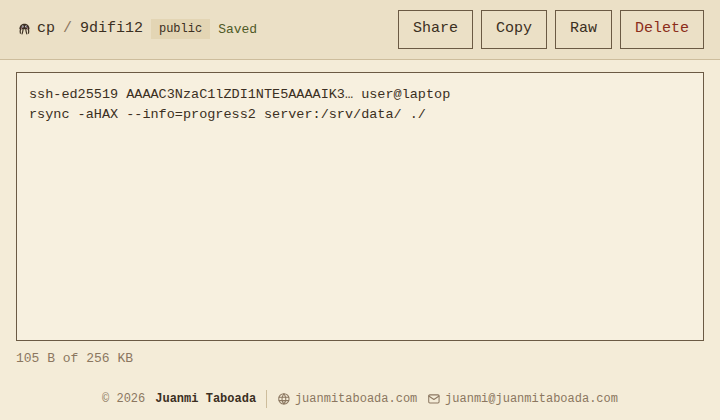</td>
  </tr>
  <tr><td colspan="2"><b>L · High contrast</b> · <code>contrast</code> · pure black and white, accessible</td></tr>
  <tr>
    <td>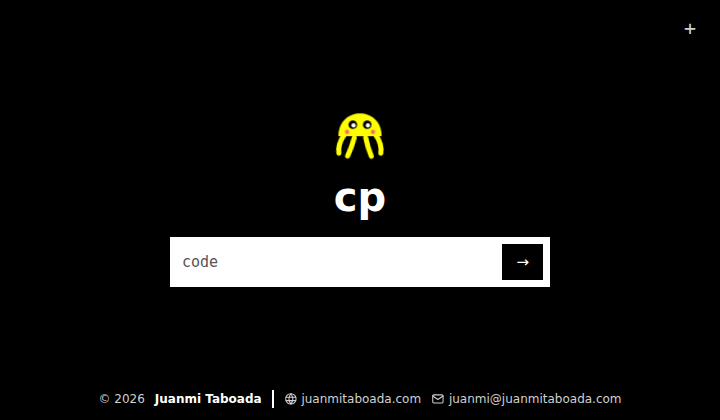</td>
    <td>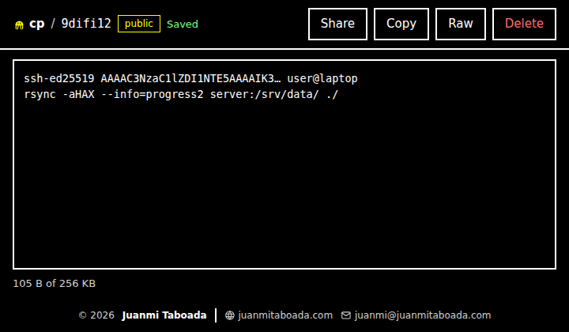</td>
  </tr>
  <tr><td colspan="2"><b>M · Pastel</b> · <code>pastel</code> · lilac and mint, very rounded</td></tr>
  <tr>
    <td>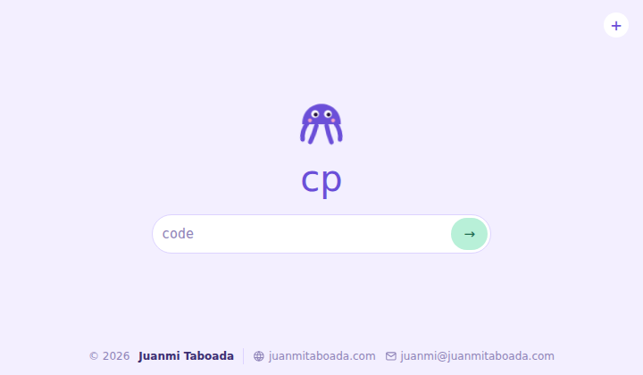</td>
    <td>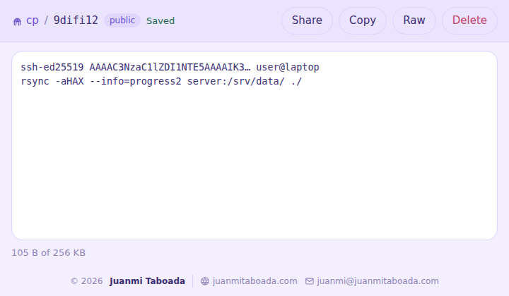</td>
  </tr>
  <tr><td colspan="2"><b>N · Dracula</b> · <code>dracula</code> · dark, pink and purple</td></tr>
  <tr>
    <td>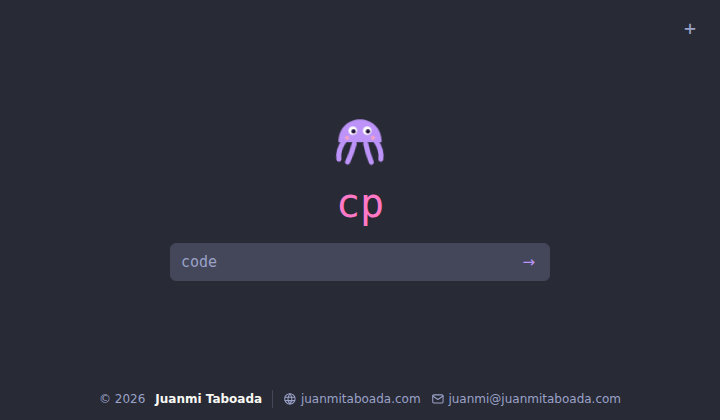</td>
    <td>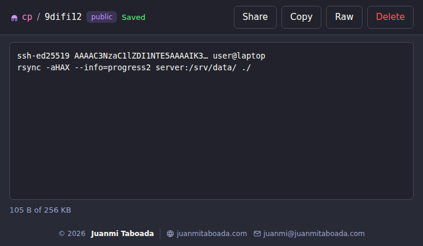</td>
  </tr>
</table>

`etc/theme` holds one name, or two separated by a space to follow the visitor's system
preference (`light-theme dark-theme`, e.g. `paper night`). Lines starting with `#` are
ignored. An unknown or invalid name falls back to `terminal`. The file is read on every
request, so no reload is needed:

```sh
echo 'paper night' > "$CP_ROOT/etc/theme"
```

A theme is a small stylesheet in `app/public/static/themes/` that only sets the CSS
variables declared at the top of `app/public/static/style.css` (plus, at most, a few
rules of its own); copy one to make your own. `tools/screenshots.py` regenerates the
images above.

## Layout on the server

Everything lives under one directory of your choice, `$CP_ROOT` below
(e.g. `/var/www/cp`, `/srv/cp`). The app finds `data/` and `etc/secret` relative to
itself, so the only place the path is written down is the nginx, php-fpm and systemd
config.

```
$CP_ROOT/app/public/static/   CSS, JS, favicon (nginx root: only static files are served)
$CP_ROOT/app/src/front.php    the only PHP script nginx ever runs
$CP_ROOT/app/bin/purge.php    expiry purge (systemd timer)
$CP_ROOT/etc/secret           HMAC key for unlock cookies (root:$CP_GROUP 0640)
$CP_ROOT/etc/htpasswd         basic auth users (root:www-data 0640)
$CP_ROOT/etc/theme            theme name(s), see Themes (root:root 0644)
$CP_ROOT/data.img             ext4 image, 16 MiB / 4096 inodes
$CP_ROOT/data/{public,private}/<code>.{txt,json}   loop mount, nodev,nosuid,noexec
```

## Install (manual)

Every step below is a plain command you can run and inspect one at a time. `install.sh`
does exactly the same thing unattended; it is optional.

The config templates in `deploy/` contain placeholders (`@NAME@`, `@USER@`, `@GROUP@`, `@ROOT@`,
`@DOMAIN@`, `@SOCKET@`, `@WEBGROUP@`). Step 0 defines a small `render` helper that fills them in with
`sed`; you can also copy the templates and edit them by hand.

### 0. Variables (same shell for all steps)

```sh
sudo -i
CP_NAME=cp                          # instance name: [a-z0-9_] only (nginx variable, file names); unique per site
CP_USER=cp                          # unix user PHP runs as; do not share it with other sites
CP_GROUP=cp                         # its group; never the nginx group (it could then read etc/secret)
CP_ROOT=/var/www/cp                 # your directory; absolute, no spaces (it goes into fstab)
CP_DOMAIN=copypaste.example.com
CP_SRC=/root/cp                     # where you unpacked cp.tar.gz
PHPV=8.4
render() {
    sed -e "s|@NAME@|${CP_NAME}|g" -e "s|@USER@|${CP_USER}|g" -e "s|@GROUP@|${CP_GROUP}|g" \
        -e "s|@DOMAIN@|${CP_DOMAIN}|g" -e "s|@ROOT@|${CP_ROOT}|g" \
        -e "s|@SOCKET@|/run/php/${CP_NAME}.sock|g" -e "s|@WEBGROUP@|www-data|g" "$1"
}
```

### 1. Prerequisites

```sh
date
command -v php php-fpm${PHPV} nginx htpasswd mkfs.ext4 rg  # packages: php8.4-cli php8.4-fpm nginx apache2-utils e2fsprogs ripgrep
php -r 'var_dump(defined("PASSWORD_ARGON2ID"));'          # expect bool(true)
getent group www-data                                     # group of the nginx workers
rg -n '^\s*user\s' /etc/nginx/nginx.conf                  # expect: user www-data;
ls /etc/letsencrypt/live/${CP_DOMAIN}/                     # fullchain.pem, privkey.pem
date
```

No certificate yet: `certbot certonly --nginx -d ${CP_DOMAIN}` (DNS record first).
If nginx runs as another group, replace `www-data` in `render` and in step 4.

### 2. System user

php-fpm runs each cp instance as its own user, so a bug in cp cannot touch other sites
(not even another cp instance).

```sh
getent group "$CP_GROUP" >/dev/null || groupadd --system "$CP_GROUP"
id "$CP_USER" >/dev/null 2>&1 || useradd --system --gid "$CP_GROUP" --home-dir /nonexistent \
    --no-create-home --shell /usr/sbin/nologin "$CP_USER"
id "$CP_USER"                      # check the primary group is $CP_GROUP
```

### 3. Application code

Code is owned by root and read-only for `$CP_USER`: PHP can never modify its own code.

```sh
install -d -o root -g root -m 0755 "$CP_ROOT"
cp -r "$CP_SRC/app" "$CP_ROOT/"
chown -R root:root "$CP_ROOT/app"
find "$CP_ROOT/app" -type d -exec chmod 0755 {} +
find "$CP_ROOT/app" -type f -exec chmod 0644 {} +
```

### 4. Secret, basic-auth users and theme

`etc/` is 0751 so nginx can reach `htpasswd` without being able to list or read `secret`.

```sh
install -d -o root -g "$CP_GROUP" -m 0751 "$CP_ROOT/etc"
( umask 027; head -c 48 /dev/urandom | base64 -w0 > "$CP_ROOT/etc/secret" )
chown root:"$CP_GROUP" "$CP_ROOT/etc/secret"; chmod 0640 "$CP_ROOT/etc/secret"
htpasswd -B -c "$CP_ROOT/etc/htpasswd" admin     # -c only the first time; it truncates the file
chown root:www-data "$CP_ROOT/etc/htpasswd"; chmod 0640 "$CP_ROOT/etc/htpasswd"
echo terminal > "$CP_ROOT/etc/theme"               # any name from the Themes section
chown root:root "$CP_ROOT/etc/theme"; chmod 0644 "$CP_ROOT/etc/theme"
```

Regenerating `secret` later only logs out password-unlocked browsers; nothing else depends on it.

### 5. Size-capped data filesystem

A 16 MiB ext4 image with 4096 inodes (small notes exhaust inodes before bytes, so both
are capped). `-m 0`: no root-reserved blocks, all space is for notes.

```sh
truncate -s 16M "$CP_ROOT/data.img"
chmod 0600 "$CP_ROOT/data.img"
mkfs.ext4 -q -N 4096 -m 0 -L cpdata "$CP_ROOT/data.img"
install -d -m 0755 "$CP_ROOT/data"
echo "$CP_ROOT/data.img $CP_ROOT/data ext4 loop,nodev,nosuid,noexec,noatime 0 2" >> /etc/fstab
systemctl daemon-reload
mount "$CP_ROOT/data"
chown "$CP_USER:$CP_GROUP" "$CP_ROOT/data"; chmod 0700 "$CP_ROOT/data"
install -d -o "$CP_USER" -g "$CP_GROUP" -m 0700 "$CP_ROOT/data/public" "$CP_ROOT/data/private"
findmnt "$CP_ROOT/data"            # expect: /dev/loopN ext4 rw,nosuid,nodev,noexec,noatime
```

On ZFS you could use a dataset with `quota=16M` instead; the loop image works on any filesystem.

### 6. php-fpm pool

```sh
render "$CP_SRC/deploy/php-fpm/cp.conf" > /etc/php/${PHPV}/fpm/pool.d/${CP_NAME}.conf
rg -n '@[A-Z]+@' /etc/php/${PHPV}/fpm/pool.d/${CP_NAME}.conf || echo 'no placeholders left'
php-fpm${PHPV} -t
systemctl reload php${PHPV}-fpm
ls -l /run/php/${CP_NAME}.sock                         # srw-rw---- root www-data
```

### 7. nginx

The site file carries `limit_req_zone` and `map` at the top: it must be included from the
`http {}` block, which is where Debian's `sites-enabled/*` already goes. Certificate and
log paths are written for letsencrypt and `/var/log/nginx/`; edit the rendered file if
yours differ.

```sh
render "$CP_SRC/deploy/nginx/cp-fastcgi.conf" > /etc/nginx/snippets/${CP_NAME}-fastcgi.conf
render "$CP_SRC/deploy/nginx/cp.conf" > /etc/nginx/sites-available/${CP_DOMAIN}.conf
rg -n '@[A-Z]+@' /etc/nginx/snippets/${CP_NAME}-fastcgi.conf /etc/nginx/sites-available/${CP_DOMAIN}.conf || echo 'no placeholders left'
ln -s /etc/nginx/sites-available/${CP_DOMAIN}.conf /etc/nginx/sites-enabled/
nginx -t
systemctl reload nginx
```

### 8. Expiry purge timer

Expired notes are also deleted when someone opens them; the timer cleans up the rest hourly.

```sh
render "$CP_SRC/deploy/systemd/cp-purge.service" > /etc/systemd/system/${CP_NAME}-purge.service
render "$CP_SRC/deploy/systemd/cp-purge.timer" > /etc/systemd/system/${CP_NAME}-purge.timer
systemctl daemon-reload
systemctl enable --now ${CP_NAME}-purge.timer
systemctl start ${CP_NAME}-purge.service; journalctl -u ${CP_NAME}-purge.service -n 3 --no-pager   # "removed 0 expired note(s)"
```

### 9. Check

```sh
date
curl -sI https://${CP_DOMAIN}/ | rg -i '^(HTTP|content-security-policy)'   # 200 + CSP
curl -s -o /dev/null -w '%{http_code}\n' https://${CP_DOMAIN}/new           # 401
curl -s -o /dev/null -w '%{http_code}\n' https://${CP_DOMAIN}/front.php     # 404
curl -s -o /dev/null -w '%{http_code}\n' https://${CP_DOMAIN}/zzz999        # 404
date
```

Then open `https://${CP_DOMAIN}/new`, create a note and open it from the home page, and
run the security audit (`tools/audit.sh`, see [SECURITY.md](SECURITY.md)) with the
same variables:

```sh
date
CP_NAME=$CP_NAME CP_USER=$CP_USER CP_GROUP=$CP_GROUP CP_ROOT=$CP_ROOT CP_DOMAIN=$CP_DOMAIN "$CP_SRC/tools/audit.sh"
date
```

Errors from PHP go to the php-fpm log (`journalctl -u php${PHPV}-fpm`), nginx errors to
`/var/log/nginx/${CP_NAME}.error.log`.

### Updating

Only `app/` changes between versions (themes included); notes, `etc/` and the image are
untouched.

```sh
rm -rf "$CP_ROOT/app.new"
cp -r "$CP_SRC/app" "$CP_ROOT/app.new"
chown -R root:root "$CP_ROOT/app.new"
find "$CP_ROOT/app.new" -type d -exec chmod 0755 {} +
find "$CP_ROOT/app.new" -type f -exec chmod 0644 {} +
mv "$CP_ROOT/app" "$CP_ROOT/app.old" && mv "$CP_ROOT/app.new" "$CP_ROOT/app" && rm -rf "$CP_ROOT/app.old"
systemctl reload php${PHPV}-fpm        # drop OPcache'd copies of the old code
```

If a release changes something in `deploy/`, re-run the matching `render` line and diff it
against the installed file before replacing it.

### Multiple instances

Each site is an independent instance with its own `CP_NAME`, `CP_DOMAIN`, `CP_ROOT` and,
for real isolation, its own `CP_USER`/`CP_GROUP`:
repeat steps 0–9 once per site. `CP_NAME` prefixes everything that is global on the
server, so instances never share or overwrite each other's:

| Resource | Per-instance name |
|----------|-------------------|
| nginx rate-limit zones and `map` variables | `${CP_NAME}_req`, `${CP_NAME}_unlock`, `$${CP_NAME}_client`, `$${CP_NAME}_unlock_key`, `$${CP_NAME}_loggable` |
| nginx FastCGI snippet | `/etc/nginx/snippets/${CP_NAME}-fastcgi.conf` |
| nginx logs | `/var/log/nginx/${CP_NAME}.{access,error}.log` |
| php-fpm pool and socket | `[${CP_NAME}]`, `/run/php/${CP_NAME}.sock` |
| systemd units | `${CP_NAME}-purge.{service,timer}` |

The unix identity is independent of the name (`CP_USER`, `CP_GROUP`). Two instances
can technically share one user, but then either one's PHP can read the other's notes
and secret.

Reusing a `CP_NAME` for a second site makes nginx fail with
`limit_req_zone "..._req" is already bound to key`, and would silently point both sites
at the same code and data.

### Basic-auth users

```sh
htpasswd -B "$CP_ROOT/etc/htpasswd" otheruser   # add or change (no -c!)
htpasswd -D "$CP_ROOT/etc/htpasswd" otheruser   # remove
```

nginx rereads the file on each request; no reload needed.

## Command line

```sh
curl -s https://copypaste.example.com/abc123                        # read (curl gets raw text)
curl -s --data-binary @file https://copypaste.example.com/abc123?a=save   # overwrite (no conflict check)
curl -s -u admin https://copypaste.example.com/private/abc123      # private note
curl -s -X POST 'https://copypaste.example.com/abc123?a=reveal&raw'  # burn-after-reading note
curl -s -H "X-CP-Base: $(printf %s "$text" | sha256sum | cut -d' ' -f1)" \
     'https://copypaste.example.com/abc123?a=poll'      # 204 unchanged, 200 {hash,content}
```

Notes are created only through `/new`; saving to a code that does not exist returns 404.

## Security

Short version: nginx only ever runs one fixed PHP script for a fixed set of URL shapes;
PHP runs in its own pool and user, jailed with `open_basedir`, without process or
network functions; notes live on a size-capped `noexec` image; strict CSP and CSRF
checks; rate limits on requests and password attempts. Public `edit` notes are open by
design to whoever guesses their code, and note content is stored in clear.

[SECURITY.md](SECURITY.md) has the full threat model, the hardening in place, known
limitations, how to report a vulnerability and how to audit an installation with
`tools/audit.sh`.

## Tests

```sh
tests/app_test.sh     # PHP behaviour through php -S (needs php, curl, rg)
sudo tests/nginx_test.sh   # nginx routing with a FastCGI echo stub (binds :80/:443)
tests/ui_test.py      # browser flow via Playwright/Chromium (optional)
tools/screenshots.py  # regenerate docs/themes/*.png (Playwright/Chromium)
```

GitHub Actions (`.github/workflows/ci.yml`) runs on every push and pull request: PHP,
JavaScript, shell (shellcheck) and Python syntax, the version consistency check, the
app and nginx suites (as root, so the disk-full case runs too) and the browser suite.

## Releases

The version lives in `VERSION` and must match the README badge and the latest release
in [CHANGELOG.md](CHANGELOG.md); `tools/check_version.sh` checks it (CI does too, and
also that a `vX.Y.Z` tag matches `VERSION`). To release:

```sh
$EDITOR VERSION CHANGELOG.md README.md   # bump all three, move "Unreleased" items under the new version
tools/check_version.sh
git commit -am "Release vX.Y.Z" && git tag -s vX.Y.Z && git push --follow-tags
```

## Uninstall

With the variables from step 0 set:

```sh
systemctl disable --now ${CP_NAME}-purge.timer
rm /etc/systemd/system/${CP_NAME}-purge.{service,timer} /etc/php/${PHPV}/fpm/pool.d/${CP_NAME}.conf \
   /etc/nginx/snippets/${CP_NAME}-fastcgi.conf /etc/nginx/sites-{enabled,available}/${CP_DOMAIN}.conf
systemctl daemon-reload; systemctl reload php${PHPV}-fpm nginx
umount "$CP_ROOT/data"
rg -n "^$CP_ROOT/data.img " /etc/fstab             # the line about to be removed
sed -i "\#^$CP_ROOT/data.img #d" /etc/fstab
rm -rf "$CP_ROOT"
# Only if no other instance uses them. userdel already removes a same-named group.
userdel "$CP_USER"; getent group "$CP_GROUP" >/dev/null && groupdel "$CP_GROUP"
```

## Author

[Juanmi Taboada](https://www.juanmitaboada.com) · <juanmi@juanmitaboada.com> — see [AUTHORS](AUTHORS).

## License

Licensed under the Apache License, Version 2.0; see [LICENSE](LICENSE).

Design inspired by [minimalist-web-notepad](https://github.com/pereorga/minimalist-web-notepad)
(also Apache-2.0); no code was copied from it.

---

© 2026 [Juanmi Taboada](https://www.juanmitaboada.com) · Apache License 2.0
